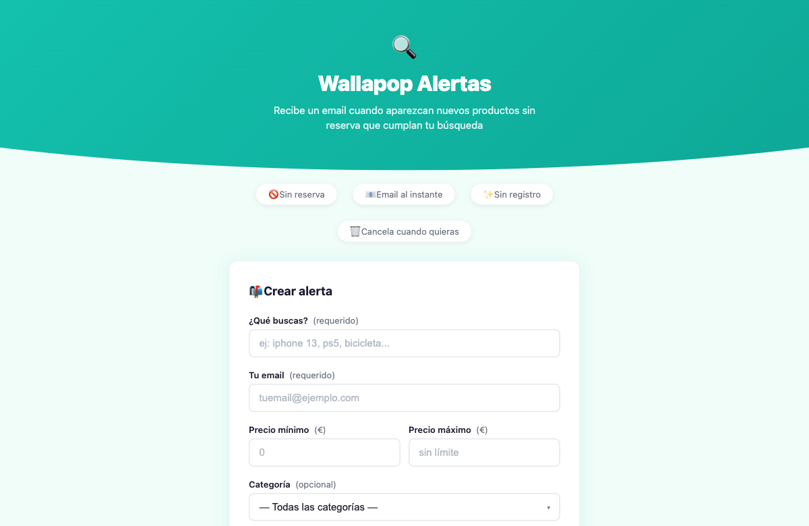
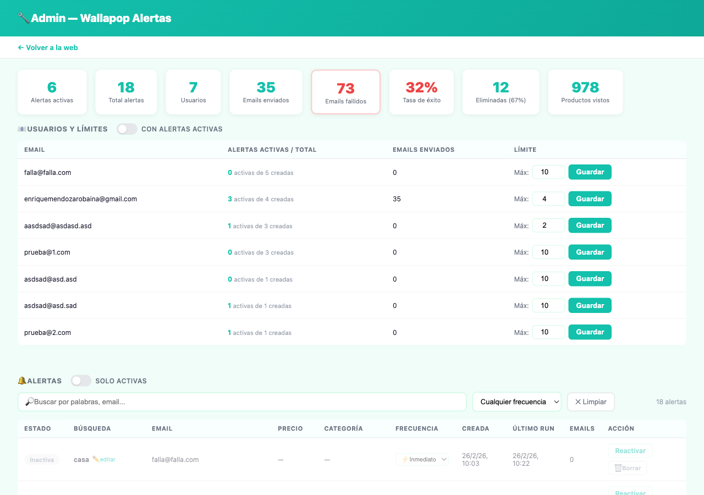

# 🔍 Userd Items Alert Agent

> Monitor a Spanish Used Items website for new listings and get notified instantly — via CLI, email, or a public web interface.



> **Panel de administración** (`/admin`)
> 

---

## ✨ Features

- 🔎 **Keyword search** with price range and category filters
- 🚫 **Excludes reserved and sold** items automatically
- 📧 **Email alerts** with product photo, price, description and direct link
- 🌐 **Web interface** — anyone can subscribe without registering
- ❌ **One-click unsubscribe** link in every email
- 💾 **Persistent history** — no duplicate alerts between restarts
- 🛡️ **Auto-recovery** on browser crashes
- 🔄 **Continuous polling** with configurable interval

---

## 🚀 Quick Start

```bash
# Clone and install
git clone https://github.com/enrimr/used-items-alert-agent.git
cd used-items-alert-agent
npm install

# Configure
cp .env.example .env
# Edit .env with your settings
```

---

## 🖥️ Mode 1 — CLI (personal use)

Monitor the Spanish Used Items website for your own searches from the terminal.

```bash
npm start           # Continuous monitoring loop
npm run once        # Single search
node index.js --help
```

**Configure `.env`:**
```env
KEYWORDS=iphone 13
MIN_PRICE=100
MAX_PRICE=500
CATEGORY_ID=12579       # Optional
POLL_INTERVAL_SECONDS=90
```

---

## 🌐 Mode 2 — Web Server (public service)

Run a web interface where anyone can create their own Used Items alerts.

```bash
npm run web         # Start web server + background worker
npm run web:only    # Start web server only (no worker)
```

**How it works:**
1. User fills in the form (keywords, price, category, email)
2. Alert is saved to SQLite — no account needed
3. Background worker polls Used Items website every 2 minutes for each subscription
4. New products → HTML email with unsubscribe link
5. User clicks "❌ Eliminar esta alerta" → alert deleted

**Configure `.env` for web:**
```env
# Web server
WEB_PORT=3000
BASE_URL=http://localhost:3000   # Your public domain in production

# Worker interval
WORKER_INTERVAL_SECONDS=120

# Email (SMTP)
EMAIL_FROM=turemitente@gmail.com
EMAIL_SMTP_HOST=smtp.gmail.com
EMAIL_SMTP_PORT=587
EMAIL_SMTP_SECURE=false
EMAIL_SMTP_USER=turemitente@gmail.com
EMAIL_SMTP_PASS=xxxx xxxx xxxx xxxx   # Gmail App Password
```

---

## ⚙️ Full `.env` Reference

```env
# ── SEARCH (CLI mode) ──────────────────────────────────────
KEYWORDS=iphone 13           # Required
MIN_PRICE=100                # Optional
MAX_PRICE=500                # Optional
CATEGORY_ID=12579            # Optional (see categories below)
POLL_INTERVAL_SECONDS=90     # Minimum 30
MAX_RESULTS=40
HEADLESS=true

# ── NOTIFICATIONS (CLI mode) ───────────────────────────────
DESKTOP_NOTIFICATIONS=true
SAVE_TO_FILE=true
OUTPUT_FILE=./encontrados.json

# ── EMAIL ──────────────────────────────────────────────────
EMAIL_TO=me@example.com      # CLI mode recipient
EMAIL_FROM=sender@gmail.com
EMAIL_SMTP_HOST=smtp.gmail.com
EMAIL_SMTP_PORT=587
EMAIL_SMTP_SECURE=false
EMAIL_SMTP_USER=sender@gmail.com
EMAIL_SMTP_PASS=app_password

# ── WEB SERVER ─────────────────────────────────────────────
WEB_PORT=3000
BASE_URL=http://localhost:3000
WORKER_INTERVAL_SECONDS=120
```

---

## 🏷️ Category IDs

| ID | Category |
|----|----------|
| `12465` | Tecnología |
| `12579` | Móviles y telefonía |
| `15000` | Informática |
| `12545` | Moda y accesorios |
| `12543` | Motor |
| `12463` | Deporte y ocio |
| `12459` | Hogar y jardín |
| `12467` | Televisión y audio |
| `12461` | Consolas y videojuegos |
| `12473` | Cámaras y fotografía |
| `14000` | Coleccionismo |
| `12449` | Libros y música |
| `12469` | Bebés y niños |
| `12471` | Otros |

---

## 🏗️ Project Structure

```
used-items-alert-agent/
│
├── index.js              # CLI entry point
├── server.js             # Web server entry point
│
├── src/
│   ├── agent.js          # CLI polling loop with auto-recovery
│   ├── scraper.js        # Puppeteer scraper (intercepts /api/v3/search/section)
│   ├── config.js         # Loads and validates .env
│   ├── store.js          # Persistent seen-items store (JSON)
│   ├── notifier.js       # Console output + desktop notifications
│   └── emailer.js        # SMTP email for CLI mode
│
├── web/
│   ├── server.js         # Express routes: /, /subscribe, /unsubscribe/:id
│   ├── worker.js         # Background worker for all subscriptions
│   ├── mailer.js         # HTML email templates with unsubscribe link
│   ├── db.js             # SQLite: subscriptions + seen items per user
│   └── public/
│       └── index.html    # Frontend form (no framework, pure HTML/CSS/JS)
│
├── docs/
│   └── screenshot.png    # Web interface screenshot
│
├── .env.example          # Configuration template
└── LICENSE               # MIT
```

---

## 📧 Gmail App Password

1. Enable 2-Step Verification on your Google account
2. Go to https://myaccount.google.com/apppasswords
3. Create an app password for "Mail"
4. Use it as `EMAIL_SMTP_PASS` in `.env`

---

## ☁️ Deploy

> **Vercel note:** Vercel does **not** support persistent SQLite, long-running background workers or Puppeteer. Use Railway or Render instead.

---

### 🚂 Railway

Railway supports persistent volumes, background workers and Docker natively.

**Steps:**

1. **Fork / push** this repo to GitHub
2. Go to [railway.app](https://railway.app) → **New Project** → **Deploy from GitHub repo** → select your fork
3. Railway will detect the `Dockerfile` and start the first deploy
4. **Create a persistent Volume** for the SQLite database (see below ↓)
5. Set the **environment variables** listed below
6. Railway will redeploy automatically

#### 💾 Creating the persistent Volume (important!)

Without a volume, the SQLite database is **lost on every redeploy**. Follow these steps:

1. In your Railway project, click on your **service** (not the project)
2. Go to the **Volumes** tab (in the service settings sidebar)
3. Click **+ New Volume**
4. Set:
   - **Mount path**: `/data`
   - **Size**: 1 GB (free tier)
5. Click **Create**
6. Add the environment variable `DB_PATH=/data/alerts.db`
7. Railway will redeploy — from now on the database persists across deploys ✅

> ℹ️ If you don't see the **Volumes** tab, make sure you are inside the **service** settings, not the project settings.

#### 🔑 Environment variables

```env
BASE_URL=https://yourapp.up.railway.app
EMAIL_FROM=noreply@tudominio.com
RESEND_API_KEY=re_xxxxxxxxxxxxxxxxxxxx   # recommended — Railway blocks SMTP
RESEND_EMAIL_FROM=noreply@tudominio.com
WORKER_INTERVAL_SECONDS=120
HEADLESS=true
DB_PATH=/data/alerts.db                  # must match your volume mount path
ADMIN_PASSWORD=yourpassword
MAX_ALERTS_PER_EMAIL=10
```

> ⚠️ Railway **blocks outbound SMTP** (ports 587/465). Use **Resend** (`RESEND_API_KEY`) instead of `EMAIL_SMTP_*`.

---

### 🎨 Render

Render supports Docker deploys with persistent disks and free tier.

**Steps:**

1. **Fork / push** this repo to GitHub
2. Go to [render.com](https://render.com) → **New → Web Service** → connect your repo
3. Choose **Docker** as the runtime (Render detects the `Dockerfile` automatically)
4. Set **Start Command**: `node server.js`
5. Add a **Persistent Disk**:
   - Mount path: `/data`
   - Size: 1 GB (free tier allows 1 GB)
6. Set these **environment variables** in Render:

```env
BASE_URL=https://yourapp.onrender.com
EMAIL_FROM=noreply@tudominio.com
RESEND_API_KEY=re_xxxxxxxxxxxxxxxxxxxx   # recommended (Render may block SMTP)
RESEND_EMAIL_FROM=noreply@tudominio.com
WORKER_INTERVAL_SECONDS=120
HEADLESS=true
DB_PATH=/data/alerts.db
ADMIN_PASSWORD=yourpassword
MAX_ALERTS_PER_EMAIL=10
```

7. Click **Create Web Service** — Render will build the Docker image and deploy

> ⚠️ Free tier on Render **spins down after 15 min of inactivity**. Upgrade to Starter ($7/mo) for always-on service.
> ⚠️ Render may also **block outbound SMTP**. Use **Resend** to be safe.

---

## 📧 Email Verification

When enabled, users must confirm their email address before their alert becomes active. This prevents abuse (alerts created with someone else's email) and ensures delivery quality.

**How it works:**
1. User submits the form → alert is created in the DB with `verified = 0`
2. A confirmation email is sent with a unique link: `GET /verify/<token>`
3. Until the user clicks the link, the worker **skips** that subscription
4. After clicking → `verified = 1`, alert activates immediately

**Enable/disable:**
```env
REQUIRE_EMAIL_VERIFICATION=false   # default: off (alert activates instantly)
REQUIRE_EMAIL_VERIFICATION=true    # sends verification email before activating
```

> ⚠️ Requires email to be configured (`RESEND_API_KEY` or `EMAIL_SMTP_*`). If no email transport is set up, alerts will never activate when verification is required.

---

## 🚚 Shipping filter

Users can check "Solo productos con envío" (shipping only) when creating an alert. When enabled:

- The scraper adds `shipping_available=true` to the Wallapop search URL
- Only products that offer shipping are returned and notified

**In the form:** checkbox "🚚 Solo productos con envío" below the frequency selector.

**In the DB:** stored as `shipping_only = 1` on the subscription row.

---

## 🛡️ Auto-deactivation on email failures

The worker tracks **consecutive email delivery failures** per subscription. If an email address accumulates N consecutive failures (default: 5), **all active alerts for that email are automatically deactivated** to prevent pointless retries.

**How it works:**
- Each time an alert email fails → `consecutive_failures` counter is incremented
- Each time an email is sent successfully → counter is reset to 0
- When the counter reaches the threshold → all active subscriptions for that email are deactivated

**In the logs:**
```
❌ [user@email.com] "iphone 13" → email FALLÓ
⚠️ Auto-desactivadas 3 alerta(s) de user@email.com tras 5 fallos consecutivos
🚫 [user@email.com] alertas auto-desactivadas tras 5 fallos consecutivos
```

**Configure the threshold:**
```env
EMAIL_FAILURE_THRESHOLD=5   # default: 5 consecutive failures
```

---

## 🎨 Themes

Choose a color theme via `THEME_COLOR` in `.env` or Railway variables:

| Value | Color | Preview |
|-------|-------|---------|
| `orange` | Warm orange *(default)* | `#f97316` |
| `teal` | Teal/green | `#13c1ac` |
| `purple` | Violet/indigo | `#7c3aed` |
| `blue` | Sky blue | `#2563eb` |
| `neutral` | Slate gray | `#475569` |

```env
THEME_COLOR=orange   # or: teal | purple | blue | neutral
```

The theme applies to the web form, admin panel, and email templates.

**Reactivating alerts:** deactivated alerts can be re-enabled from the admin panel at `/admin` using the "Reactivar" button.

---

## 🔧 Admin Panel

Access the admin dashboard at `/admin` (password-protected via `ADMIN_PASSWORD`).

**Features:**
- 📊 **8 KPI stats**: active alerts, total, users, emails sent/failed, success rate, deleted %, products processed
- 📧 **Users & limits**: view alerts per email, set per-email alert limits, filter users with active alerts
- 🔔 **Alerts table**: search/filter by keyword, email, frequency and active status; inline editing of keywords, price, category and frequency
- ✏️ **Inline edit**: click any row's search term to edit keywords, price range and category
- ♻️ **Reactivate** deleted alerts with one click
- 🗑️ **Permanent delete** with double confirmation
- 📄 **Pagination** on both tables (10 rows/page)

```env
ADMIN_PASSWORD=yourpassword       # required to enable admin
MAX_ALERTS_PER_EMAIL=10           # global limit, overridable per-email in admin
EMAIL_FAILURE_THRESHOLD=5         # auto-deactivate after N consecutive failures
```

---

## ⚠️ Notes

- Uses Puppeteer headless browser to bypass Wallapop's CloudFront protection
- Recommended minimum interval: 60-90 seconds to avoid overloading the server
- The web worker polls subscriptions in parallel (default: 3 concurrent) — configurable via `WORKER_CONCURRENCY`
- Digest items (daily/weekly) are persisted in SQLite and survive server restarts
- Seen items are stored per-subscription in SQLite (web) or JSON file (CLI)

### Worker concurrency

By default the worker processes up to 3 subscriptions in parallel, each using its own browser context (page). Increase this for more users, decrease it to save memory:

```env
WORKER_CONCURRENCY=3   # default: 3 parallel subscriptions
```

Each concurrent worker shares the same Chromium browser instance but uses separate pages to avoid state collisions.

---

## 📄 License

MIT © [Enrique Mendoza](https://github.com/enrimr)

*If you use this project, a mention or star ⭐ is appreciated!*
